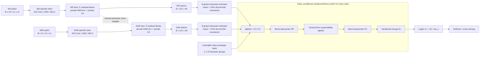

# VBE-Net 架构与最小数值原型设计规范

日期：2026-09-01

状态：待用户确认
暂定名称：VBE-Net（Variational Bures Energy Network）

## 1. 目标与本阶段边界

VBE-Net 面向配准的多光谱（MS）与 SAR 图像块分类。本设计不沿用现有 MGHOFNet 或用户已有模型，而是从“类别条件下的多模态概率一致性”出发，把特征融合、模态责任分配和分类统一为同一个变分能量最小化问题。

本阶段只交付：

1. 可渲染的完整架构图；
2. Bures 几何与类别条件变分求解器的最小数值原型；
3. solver 正确性、可微性、梯度稳定性和前向复杂度报告；
4. 是否进入完整编码器训练的明确决策结论。

本阶段不接入真实数据集，不进行准确率对比，也不实现完整训练流水线。通过本规范定义的数值门槛后，再实现并训练完整网络。

## 2. 核心研究假设

每个模态的局部特征不是单个向量，而是一组局部样本形成的高斯分布。类别也由可学习的高斯原型表示。正确类别应当能够以较低代价找到一个同时接近类别原型和两个模态观测的融合分布；模态冲突应增加能量，而不应被普通拼接或自由门控悄然消除。

对候选类别 \(c\)，定义

\[
\mathcal F_c(R,\alpha)=
\lambda D_{\mathcal M}^2(R,\Pi_c)
+\sum_{m\in\{\mathrm{MS},\mathrm{SAR}\}}\alpha_mD_{\mathcal M}^2(R,Q_m)
+\tau_r\operatorname{KL}(\alpha\|\pi),
\]

其中：

- \(Q_m\) 是模态 \(m\) 的分组高斯表示；
- \(\Pi_c\) 是类别 \(c\) 的可学习分组高斯原型；
- \(R\) 是候选类别条件下的融合分布；
- \(\alpha\) 位于概率单纯形上，是“类别条件模态责任”，不是未经标定的传感器可靠性；
- \(\pi=(0.5,0.5)\) 是责任先验；
- \(D_{\mathcal M}\) 是乘积高斯流形上的归一化 2-Wasserstein/Bures 距离。

类别能量和分类 logit 为

\[
E_c^*=\min_{R,\alpha}\mathcal F_c(R,\alpha),
\qquad z_c=-E_c^*/\tau_c.
\]

训练目标只使用交叉熵。模型不增加辅助分类器、对齐损失、对比损失或额外门控网络。

## 3. 完整架构



### 3.1 输入与空间编码器

- MS 输入：`[B, 10, 11, 11]`；
- SAR 输入：`[B, S, 11, 11]`，其中 `S` 由数据决定，预计为 2 或 4；
- 两个模态各自使用 `3x3 Conv(padding=1) -> modality-specific LayerNorm2d -> GELU`，输出 64 通道；
- 不下采样，始终保留 `11x11` 空间网格；
- 主干由 5 个半共享残差块组成。每块保留模态私有的深度卷积与归一化参数，共享跨通道混合权重：

\[
U_m^l=F_m^l+\operatorname{DWConv}_m^l(\operatorname{LN}_m^l(F_m^l)),
\]

\[
F_m^{l+1}=U_m^l+W_2^l\operatorname{GELU}
\left(W_1^l\operatorname{LN}'_m(U_m^l)\right),
\]

其中 \(W_1:64\rightarrow256\)，\(W_2:256\rightarrow64\)。5 层 `3x3` 深度卷积给出覆盖 `11x11` 的理论感受野。最终展平为 `[B, 121, 64]` token。

半共享编码器用于保留不同成像机制并控制参数量，是支撑设计而非主要理论贡献。

### 3.2 分组收缩高斯表示

64 个通道分为 \(G=8\) 组，每组维度 \(k=8\)。对每个模态和每组，以 121 个空间 token 为样本，估计均值 \(\mu\) 与经验协方差 \(S\)，再使用 OAS 收缩：

\[
\Sigma=(1-\rho)S+\rho\frac{\operatorname{tr}(S)}{k}I+\varepsilon I,
\qquad \varepsilon=10^{-4}.
\]

为避免实现歧义，原型采用分母为 \(N\) 的经验协方差，并按下式逐样本、逐组计算 OAS 系数：

\[
\rho=\operatorname{clip}_{[0,1]}\left(
\frac{(1-2/k)\operatorname{tr}(S^2)+\operatorname{tr}(S)^2}
{(N+1-2/k)\left[\operatorname{tr}(S^2)-\operatorname{tr}(S)^2/k\right]+10^{-12}}
\right),\qquad N=121.
\]

模型表示位于 8 个 8 维高斯流形的乘积空间。两组高斯 \(Q_a=(\mu_a,\Sigma_a)\) 与 \(Q_b=(\mu_b,\Sigma_b)\) 的距离为

\[
d_B^2(Q_a,Q_b)=\|\mu_a-\mu_b\|_2^2+
\operatorname{tr}\left(\Sigma_a+\Sigma_b-
2(\Sigma_a^{1/2}\Sigma_b\Sigma_a^{1/2})^{1/2}\right).
\]

乘积距离对 8 组求和并除以 64，使能量尺度不随分组总维度线性膨胀。

### 3.3 类别原型库

每个类别保存 8 个可学习高斯原型：

- 均值参数：`prototype_mean[C, 8, 8]`；
- 协方差参数：`prototype_raw_tril[C, 8, 8, 8]`；
- 只取下三角部分，主对角线使用 `softplus(x) + 1e-3`；
- 协方差构造为 \(LL^\top+\varepsilon I\)，从参数化层面保证正定。

### 3.4 变分 Bures 求解器

固定 \(\alpha\) 时，\(R\) 是类别原型和模态分布的加权 Bures 重心。归一化权重为

\[
w_p=\frac{\lambda}{\lambda+1},\quad
w_{\mathrm{MS}}=\frac{\alpha_{\mathrm{MS}}}{\lambda+1},\quad
w_{\mathrm{SAR}}=\frac{\alpha_{\mathrm{SAR}}}{\lambda+1}.
\]

重心均值有闭式解。协方差使用固定点迭代。对输入 SPD 矩阵 \(S_i\) 及权重 \(w_i\)：

\[
A_l=\sum_iw_i(R_l^{1/2}S_iR_l^{1/2})^{1/2},
\]

\[
R_{l+1}=R_l^{-1/2}A_l^2R_l^{-1/2}.
\]

初值为加权算术均值，首个工程版本使用 3 次内层迭代。

固定 \(R\) 时，严格凸的熵正则责任子问题具有闭式解：

\[
\alpha_m^c=
\frac{\pi_m\exp[-D_{\mathcal M}^2(R_c,Q_m)/\tau_r]}
{\sum_j\pi_j\exp[-D_{\mathcal M}^2(R_c,Q_j)/\tau_r]}.
\]

默认采用一个外层循环：

```text
alpha0 = [0.5, 0.5]
R0     = BuresBarycenter(prototype_c, Q_MS, Q_SAR; alpha0)
alpha1 = ClosedFormResponsibility(R0, Q_MS, Q_SAR)
R1     = BuresBarycenter(prototype_c, Q_MS, Q_SAR; alpha1)
E_c    = F_c(R1, alpha1)
```

初始超参数为 `lambda=1.0`、`tau_r=0.3`、`tau_c=0.1`。这些数值是原型起点，不被表述为最终最优值。

### 3.5 数值稳定约束

- 所有 SPD 几何运算强制使用 FP32，即使外部启用 AMP；
- 第一版矩阵平方根和逆平方根使用 `torch.linalg.eigh`；
- 每次谱运算前后执行矩阵对称化；
- 特征值下限为 `1e-4`；
- KL 项在 log-domain 中计算；
- 责任概率使用稳定的 `log_softmax/softmax`；
- 原型阶段先保留可读的 EVD 实现，验证通过后才考虑 Newton-Schulz 等近似加速。

### 3.6 训练接口

完整训练阶段只使用最终类别能量的交叉熵。训练时以概率 0.1 随机丢弃一个模态，丢弃后仍使用同一能量函数：缺失模态从当前求解集合移除并重新归一化先验和重心权重，而不是增加专用缺失模态分支。

## 4. 最小数值原型

原型使用合成 SPD 矩阵和合成均值，不依赖数据集或完整编码器。拟实现文件：

- `models/vbe_net.py`：单文件包含空间编码器、类别原型、SPD 算子、Gaussian Bures 距离、分组距离、Bures 重心、责任更新、类别能量与完整 `VBENet`；
- `scripts/prototype_vbe_solver.py`：数值实验、速度和内存基准、结构化报告；
- `tests/test_vbe_geometry.py`：确定性单元测试和梯度测试；
- `docs/figures/vbe-net-architecture.svg`：从本规范架构生成的静态矢量图。

最小原型的代表形状为：

- 数值正确性：`B=2, C=3, G=2, k=3`；
- 代表性复杂度：`B=64, C=9, G=8, k=8`；
- 每类每组同时处理 1 个原型和 2 个模态分布；
- 比较内层迭代次数 `1/3/5`，以及零外层更新与一个外层更新的开销差异。

## 5. 验证项目与验收标准

### 5.1 几何恒等式与 SPD 安全性

确定性测试必须满足：

- 所有构造和迭代后的协方差对称，最大对称残差不超过 `1e-5`；
- 最小特征值不低于数值地板减去 `1e-6`；
- 矩阵平方根重构相对误差不超过 `1e-4`；
- Bures 距离非负，允许 `1e-6` 的浮点误差；
- `D(Q,Q)` 小于 `1e-5`；
- 距离对称误差小于 `1e-5`；
- 相同输入的重心回到该输入，相对误差小于 `1e-4`；
- `k=1` 时结果与标量/对角高斯公式一致，相对误差小于 `1e-5`。

### 5.2 责任与交替求解器

- 每个类别的 \(\alpha\) 均为正且和为 1，误差小于 `1e-6`；
- 当一个模态严格更接近当前重心时，它获得更大的责任；
- 使用高精度和充分内层迭代的参考求解器时，每个精确坐标更新均不得增加能量（容差 `1e-7`）；
- 工程配置（3 次内层迭代、1 次外层更新）单独报告能量变化分布。若出现能量上升，不用结果掩盖，而是增加内层迭代、加入收敛判据或阻尼后再评估；
- 合成的“原型与两模态完全一致”案例应产生近零几何能量；人为增大模态冲突时能量应总体上升。

### 5.3 梯度与可微性

- 在小尺寸 `float64` 输入上通过 `torch.autograd.gradcheck`；
- FP32 前向与反向不出现 NaN 或 Inf；
- 梯度可达模态均值、模态协方差参数、原型均值和原型 Cholesky 参数；
- 报告各参数组梯度范数，以及至少 100 个随机合成批次中的非有限梯度计数；
- 对重复或近重复特征值专门构造压力测试，因为 EVD 的特征向量梯度在该区域最脆弱。

### 5.4 前向复杂度

理论上，几何头的主耗时来自每个样本、类别和分组上的 \(k\times k\) SPD 谱分解，近似复杂度为

\[
O(B\,C\,G\,I\,k^3),
\]

其中 \(I\) 汇总重心固定点迭代及其矩阵平方根次数。由于 `k=8`，目标是依靠小矩阵批处理控制常数，而不是把 64 维完整协方差直接谱分解。

原型必须报告：

- 参数量；
- CPU 前向与前向+反向延迟；
- CUDA 可用时的 GPU 预热后延迟和峰值显存；
- `inner_iters=1/3/5` 的耗时与能量误差；
- `outer_updates=0/1` 的增量成本；
- 对角高斯距离作为速度参考，不作为最终替代模型。

在不知道目标硬件实测结果前不设置任意毫秒阈值。原型的职责是给出可复现数据，并计算“几何头耗时/完整前向目标预算”的比例，供进入训练前决策。

## 6. 进入完整训练的决策门槛

只有同时满足以下条件，才实现完整空间编码器和数据训练：

1. 几何恒等式、SPD 安全性和责任测试全部通过；
2. 小尺寸 gradcheck 通过，代表尺寸 FP32 梯度稳定；
3. 工程配置在合成测试中不系统性增加变分能量；
4. 代表尺寸能够在目标设备运行，显存无异常膨胀；
5. `inner_iters=3` 相对于高精度参考的能量偏差与速度折中可接受；
6. 若 EVD 反向在近重复特征值处不稳定，已有被验证的稳定化方案，而不是把异常留给完整训练阶段。

若只在复杂度上失败，优先依次尝试：减少内层迭代并加入收敛判据、缓存类原型的谱量、向量化批处理、采用经误差验证的 Newton-Schulz 平方根。不得直接退化为任意注意力或 MLP 拼接结构来保留模型名称。

## 7. 理论性质与论文表述边界

可作为后续方法部分命题进行证明的性质：

1. 固定 \(\alpha\) 时，最优 \(R\) 为类别原型和模态高斯的加权 Bures 重心；
2. 固定 \(R\) 时，熵正则责任子问题具有唯一闭式最优解；
3. 在每个子问题被精确求解时，交替坐标下降的目标值单调不增；
4. 当 \(\lambda>0\)、\(\tau_r>0\) 且先验责任为正时，零几何不一致要求原型与所有正责任模态重合，因此模态冲突不会被奖励；
5. `k=1` 是标量/对角欧氏情形的特例，完整模型通过 `k>1` 建模通道间非交换协方差结构。

论文中只把以下两点列为核心贡献：

- 类别条件变分 Bures 能量，把融合、责任分配和分类统一为一个目标；
- 分组收缩高斯表示，在可控计算量下保留非对角、非交换的二阶结构。

在完成系统检索与对照实验前，不宣称“首次”“全新”或保证高准确率。高精度是设计目标，需要由完整训练、强基线和消融实验验证。

## 8. 主要风险与应对

- **EVD 反向不稳定**：对称化、谱地板、近重复特征值压力测试；必要时采用稳定近似平方根。
- **固定点迭代不足**：同时维护高精度参考实现，量化 1/3/5 次迭代误差，并按能量下降选择阻尼或终止条件。
- **类别维度放大开销**：在 `[B,C,G,k,k]` 上批量向量化，避免 Python 类别循环；缓存与样本无关的原型量。
- **OAS 收缩过强**：原型阶段记录 \(\rho\) 分布；完整训练阶段再比较 OAS、固定收缩率和对角协方差。
- **纯几何分类器精度未知**：先验证数值机制，再通过真实数据消融判断，不在几何头旁添加难以归因的分类捷径。

## 9. 完成定义

本阶段完成时应具备：架构 SVG、可运行的几何求解器、自动化测试、梯度检查结果、复杂度报告和明确的 go/no-go 结论。任何一个关键测试失败都应记录失败条件与修正方案，而不是直接进入完整训练。
